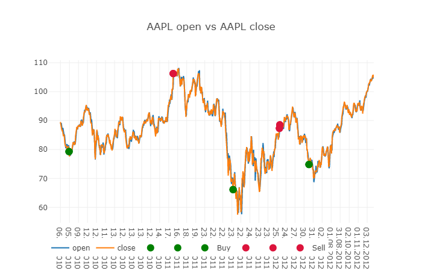

# AAPL Open Vs AAPL Close By DASH Framework

Task :
  1.Show the OPEN values on the graph by using DASH Framework.
  2.Show the CLOSE values on the same graph by using DASH Framework.
  3.Show the BUY/SELL points by dot on the same graph with different colour by using DASH Framework.
  4.Display the INITIAL CASH,PROFIT,FINAL CASH,CLOSING POINT values on hovering the buy and sell points on the same graphh by using DASH       Framework.

# Here is the screenshot of the graph.

# Here is the video link of the graph (completed all the above task)

(data/Dash(AAPL%20Open%20VS%20AAPL%20Close).mp4)

